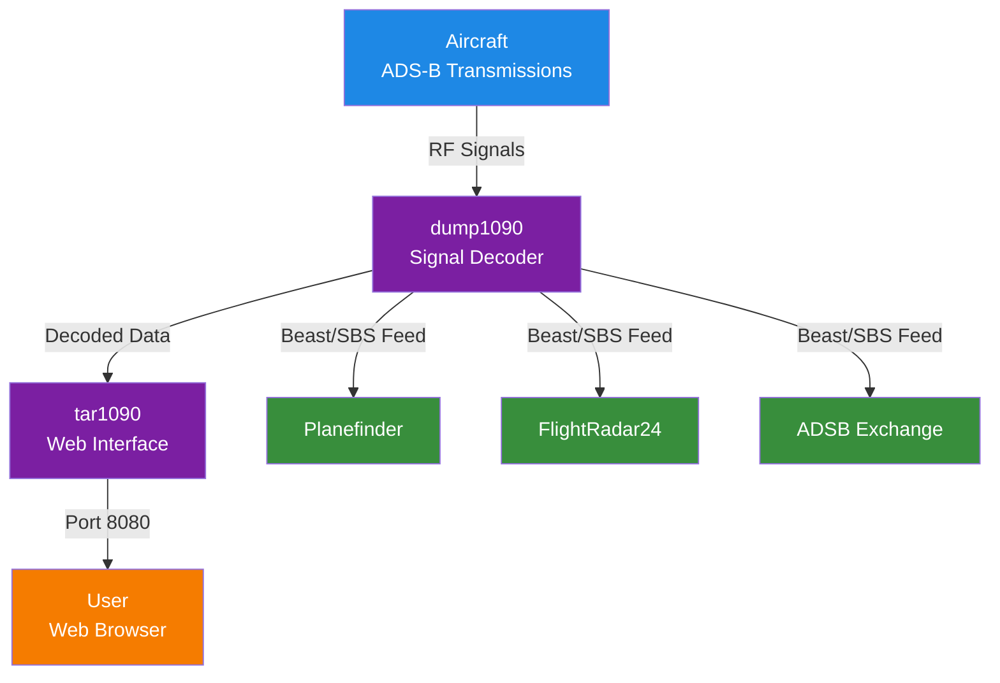

### Raspberry Pi ADS-B receiver - feeder using Docker containers

Skip the messy manual installs. With Docker containers, you can run multiple aircraft feeder instances on a single Raspberry Pi using just a USB TV stick or a more professional Airspy receiver. Modular, flexible, and easy to manage.

### Inspired by the Work of Others

We build on the fantastic contributions from:

* Alex Ellis' blog post: [Get eyes in the sky with your Raspberry Pi](https://blog.alexellis.io/track-flights-with-rpi/)
* [Alex Ellis' original github project](https://github.com/alexellis/eyes-in-the-sky)
* [LoungeFlyZ enhanced github project which added the FlightRadar24 feed](https://github.com/LoungeFlyZ/eyes-in-the-sky)
* [Mike, mikenye - Docker images for readsb, tar1090](https://github.com/mikenye)
* [wiedehopf's tar1090](https://github.com/wiedehopf/tar1090)

### Building a Fully Operational multi ADS-B Feeder

Starting from a bare-bones Raspberry Pi, you’ll be guided step by step to a fully functional setup with Docker containers — each capable of feeding a popular ADS-B site. You can easily choose which ADS-B website to feed simply by selecting the containers you launch.

For complete instructions, check out the [project GitHub page]().


  This project needs an update to the latest version of ads-b tools.

