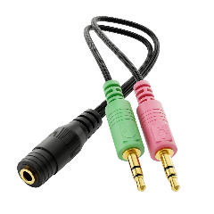
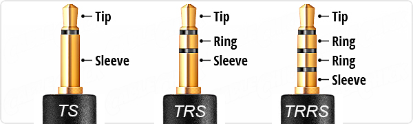
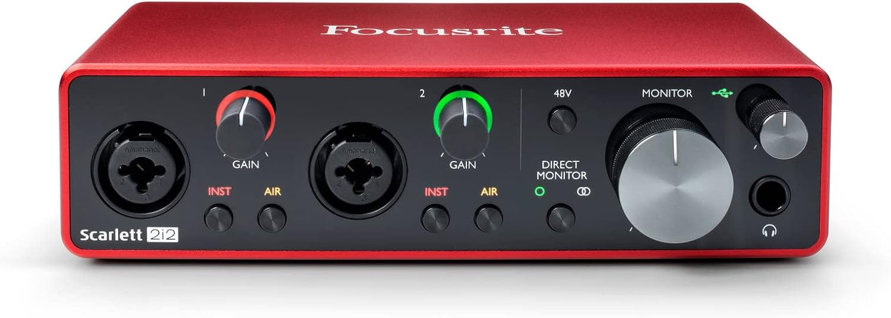
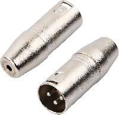
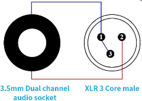
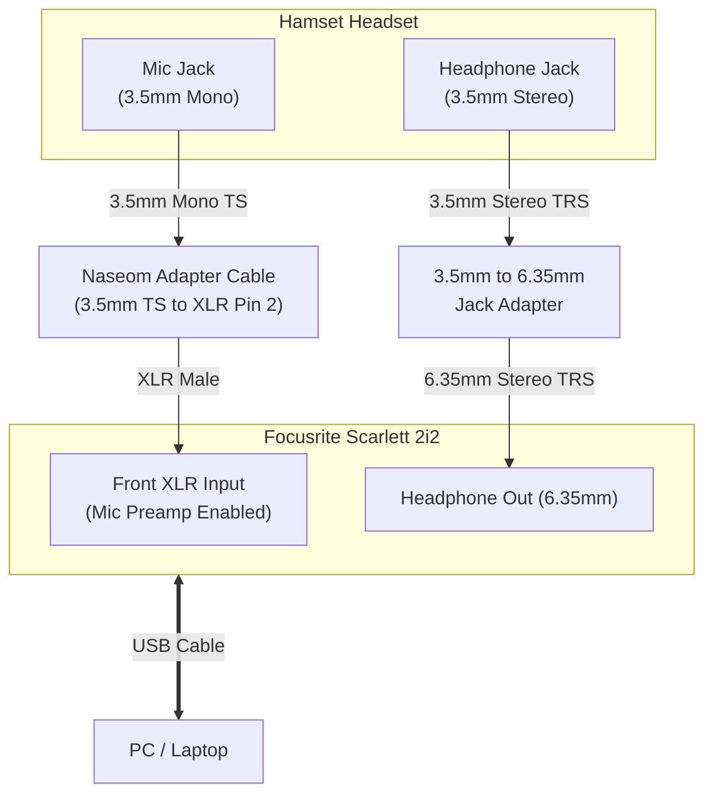

Trying to connect a radio headset from [**Hamset.com**](https://www.hamset.com) to your PC or Mac, but running into microphone issues?

Would you like to use the [**Hamset Bose QC25 headset**](https://www.hamset.com) not only when contesting but also when doing meetings or conference calls or **remote operations**?

In this short article, we explain why a direct connection (and standard splitter cables) won't work and how to solve it easily and professionally.

*(Note: this page contains affiliate links)*

## The Problem

Connecting a Hamset microphone directly to a PC usually presents two main obstacles:

1. **Incompatible Wiring & Pinout:**
   The pinout of Hamset microphones does not match standard consumer TRRS/TRS PC audio ports and/or the computer audio port is not able to correctly detect the type of microphone.

    *Why doesn't a TRRS to 2x TRS splitter work?*
    Standard splitter cables fail because the internal wiring and grounding structure of the Hamset microphone differ from consumer headsets. The signal simply does not reach the correct pins.
1. **Weak Signal Output:**
   The microphone elements in these headsets have a very low output level and require an active preamp to boost the audio to a usable line level. Plugs directly into a PC sound card result in extremely quiet or unrecordable audio.

The splitter cable solution (TRS/TRS to TRRS) will not work due to the complex RTTS microphone detection:

More detailed information about the difference between TRS - TRRS can be found on [this website](https://rasantekaudio.com/connectors/trs-connectors-a-comprehensive-guide).

## The Solution

To resolve both issues, you need two hardware components:

1. **Focusrite Scarlett 2i2** (or a similar audio interface / microphone preamp) ([View on Amazon](https://link.amazon/B09jCDQVO)).
2. **Naseom XLR (3-pin) to 3.5mm Mono Jack** ([View on Amazon](https://link.amazon/B0gN9hqMR)).

### Focusrite Scarlett 2i2 audio interface

Audio interface with at least one unbalanced microphone input and optionally an audio headset output.

*Other options are*:

- Focusrite Scarlett Solo ([View on Amazon](https://link.amazon/B0i6YO8A4))
- Behringer UMC22 ([View on Amazon](https://link.amazon/B0ig0zZbh)) (not tested)
- Behringer UMC202HD ([View on Amazon](https://link.amazon/B0fy4dYkr)) (not tested)

### XLR to 3.5mm mono jack

Converts the microphone 3.5mm jack to an unbalanced microphone (XLR).

## Why This Setup Works

The key to making this work lies in two specific technical details:

* **XLR Connector Required for Microphone Preamp:**
  Although the Focusrite Scarlett features combo inputs (XLR & 6.3mm jack), its internal **microphone preamp** is *only* engaged when an **XLR plug** is inserted. Inserting a 6.3mm jack forces the interface into instrument/line mode, bypassing the gain needed for the Hamset microphone.
* **Pin Bridging in the Naseom Cable:**
  Inside the XLR connector of this specific cable, **Pin 1 (Ground)** and **Pin 3 (Cold / Negative)** are wired together. Bridging Pin 1 and Pin 3 converts the balanced input signal into a proper unbalanced mono signal fed into Pin 2 (Hot).

## Connection Diagram

## Setup Steps

1. **Microphone Setup**: Plug the 3.5mm microphone connector from your Hamset headset into the female socket of the **Naseom XLR** plug. Connect the **XLR plug** into the front microphone input of your Focusrite Scarlett.
2. **Headphone Setup**: Connect the 3.5mm headphone connector from your Hamset headset (using a 3.5mm to 6.3mm TRS adapter if needed) directly to the **Headphone Output** on the front of the Focusrite Scarlett.
3. **PC Connection**: Connect the Focusrite interface to your **PC via USB**.
4. **Levels Adjustment**: Set the Scarlett as your primary playback and recording device in Windows, then adjust the **Mic Gain knob** on the Scarlett until your voice is crisp and clear.
