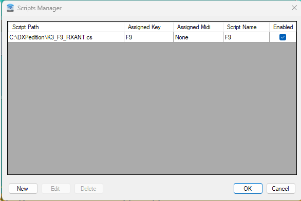
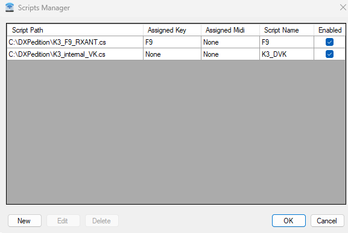
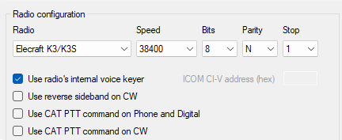

When operating an **Elecraft K3** in a contest or DXpedition environment, it is often useful to control functions of the radio directly from your logging software.

Instead of reaching for the front-panel buttons, functions such as **SUB**, **RX**, **SPLIT**, **RIT**, **XIT** and the internal voice memories can be triggered from **N1MM Logger+** or **DXLog**.

This is done using macros and the K3's **CAT command interface**.

This article explains the basic concept and shows how to implement K3 commands in N1MM or DXLog.

## What is a macro?

A macro is simply a predefined command or sequence of commands that can be executed with a single action. In contest software, macros are particularly useful because they allow you to assign frequently used radio functions to keyboard shortcuts. For example, instead of manually pressing the **RX ANT** button on the K3, you could press **F9** in your logging software. The logging software then sends a CAT command to the radio:

```text
SWT25;
```

The K3 interprets this as a simulated press of the SUB button.

The important point is that there are several layers involved:

```text
Keyboard / Function key
        ↓
Contest software macro
        ↓
CAT command
        ↓
Elecraft K3
        ↓
Radio function
```

N1MM and DXLog use a slightly different approach to macros, but the K3 command itself remains the same.

In N1MM+:

- a function key macro can be used in all operating modes (SSB, CW, digital)

In DXLog:

- a function key macro can only be used in CW and digital modes
- the function keys are dedicated to DVK in SSB mode
- scripts can be used to create custom keyboard CAT commands in any operating mode

## Macros in N1MM Logger+

In **N1MM Logger+**, K3 CAT commands can be sent using the `{CATA1ASC ...}` macro.

For example:

```text
F8 SUB,{CATA1ASC SWT48;}
F9 RX,{CATA1ASC SWT25;}
```

Here, `F8` and `F9` are the function keys assigned to the macros.

The important part is:

```text
{CATA1ASC SWT48;}
```

This tells N1MM to send the K3 CAT command:

```text
SWT48;
```

### Example: RX Antenna

```text
F9 RX,{CATA1ASC SWT25;}
```

Pressing **F9** sends `SWT25;`.

This simulates pressing the **RX ANT** button.

## Where are N1MM macros defined?

The macro definitions are entered in the **Function Key Editor** in N1MM Logger+.

This is where you define what should happen when you press keys such as F1, F2, F3, F8 or F9.

A macro therefore typically consists of:


| Part         | Example             | Purpose                    |
| ------------ | ------------------- | -------------------------- |
| Function key | `F8`                | Keyboard shortcut          |
| Label        | `SUB`               | Text shown to the operator |
| N1MM macro   | `{CATA1ASC SWT48;}` | Command sent to the K3     |

Open the message editor in N1MM+. Right-click on one of the macro buttons. The final result may look like this:

```java
F1 CQ,{CATA1ASC SWT21;}
F2 RST,{CATA1ASC SWT31;}
F3 TU,{LOG}{CATA1ASC SWT35;}
F4 CALL,{CATA1ASC SWT39;}
F5 Spare,
F6 Spare,
F7 Spare,
F8 SUB,{CATA1ASC SWT48;}
F9 RX,{CATA1ASC SWT25;}
F10 Spare,
F11 Spare,
F12 Wipe,{WIPE}
```

## N1MM vs DXLog

The underlying K3 command is the same; only the way the logging software sends it is different. An important difference is that in DXLog, macros are only available in CW/Digital mode. **In SSB mode, the function keys are dedicated to the DXLog internal Digital Voice Keyer.** There is, of course, a way to work around this: DXLog provides a very powerful C# scripting functionality that allows us to customize its behaviour to exactly match our needs. This may look more complicated at first, but it provides a flexible way to implement the functionality we need. If you only need to send K3 commands in CW or Digital mode, you can simply use the standard or additional messages described below.

## DXLog standard

We can send a command to the K3 transceiver using one of the following macro commands in the CW/Digital standard or alternate messages:


| DXLog macro command | Purpose                                             |
| ------------------- | --------------------------------------------------- |
| `$CAT1`             | Sends a CAT command to radio 1                      |
| `$CAT2`             | Sends a CAT command to radio 2                      |
| `$CATF`             | Sends a CAT command to the currently selected radio |

Using DXLog standard or additional messages:


| Function      | N1MM                | DXLog          | K3 command |
| ------------- | ------------------- | -------------- | ---------- |
| Toggle SUB    | `{CATA1ASC SWT48;}` | `$CATF=SWT48;` | `SWT48;`   |
| Toggle RX ANT | `{CATA1ASC SWT25;}` | `$CATF=SWT25;` | `SWT25;`   |
| Toggle SPLIT  | `{CATA1ASC SWT24;}` | `$CATF=SWT24;` | `SWT24;`   |

This makes converting an N1MM macro to DXLog relatively straightforward:

### N1MM

```text
{CATA1ASC SWT48;}
```

### DXLog

```text
$CATF=SWT48;
```

The K3 command itself has not changed.

## SWT vs SWH

One of the most useful concepts when controlling a K3 through CAT is the difference between: SWT and SWH. They correspond to two different ways of interacting with a physical K3 button.

### SWT — Switch Tap

`SWTxx;` simulates a **short press** of a front-panel button.

It activates the button's primary function.

For example:

```text
SWT24;
```

simulates a short press of the **SPLIT** button.

In other words:

```text
SWT = press and release
```

### SWH — Switch Hold

`SWHxx;` simulates holding the button down for approximately **0.5 seconds**.

This activates the button's secondary function where applicable.

For example:

```text
SWH24;
```

simulates holding the **SPLIT** button.

According to the K3 behaviour described in this guide, this enables Split and automatically sets VFO B to **+1 kHz**.

So:

```text
SWT24;
```

and

```text
SWH24;
```

are deliberately different.


| Command  | Meaning                  | Example  |
| -------- | ------------------------ | -------- |
| `SWTxx;` | SPLIT short button press | `SWT24;` |
| `SWHxx;` | SPLIT Button hold        | `SWH24;` |

This distinction is important when converting physical K3 button operations into CAT commands.

## K3 button simulation commands

The following commands simulate pressing buttons on the K3.


| Command  | K3 function  | Description                                        |
| -------- | ------------ | -------------------------------------------------- |
| `SWT13;` | A=B          | Copy VFO A frequency/mode to VFO B                 |
| `SWT11;` | A/B          | Swap VFO A and VFO B                               |
| `SWT24;` | SPLIT        | Toggle Split mode                                  |
| `SWH24;` | SPLIT (Hold) | Enable Split and automatically set VFO B to +1 kHz |
| `SWT12;` | REV          | Temporarily listen on the VFO B / TX frequency     |
| `SWT09;` | XFC          | Check the transmit frequency                       |
| `SWT48;` | SUB          | Toggle the sub-receiver                            |
| `SWT25;` | RX (Sub)     | Toggle sub-receiver audio                          |
| `SWT16;` | RIT          | Toggle RIT                                         |
| `SWT17;` | XIT          | Toggle XIT                                         |
| `SWT20;` | CLR          | Reset RIT/XIT offset to 0 Hz                       |
| `SWT21;` | M1           | Play internal K3 memory message 1                  |
| `SWT31;` | M2           | Play internal K3 memory message 2                  |
| `SWT35;` | M3           | Play internal K3 memory message 3                  |
| `SWT39;` | M4           | Play internal K3 memory message 4                  |
| `SWT37;` | REC          | Toggle internal memory recording start/stop        |

## A practical DXLog example

Suppose you want to create three DXLog function keys for a K3 (which will only work in CW/Digital operating mode):

- F8 = SUB
- F9 = RX Sub
- F10 = SPLIT

The K3 commands are:

```text
SWT48;
SWT25;
SWT24;
```

The corresponding DXLog macros become:

```text
$CAT1=SWT48;
$CAT1=SWT25;
$CAT1=SWT24;
```

So the complete flow is:


| Function key | DXLog macro    | K3 command | Result                                   |
| ------------ | -------------- | ---------- | ---------------------------------------- |
| F8           | `$CAT1=SWT48;` | `SWT48;`   | Toggle SUB on radio 1                    |
| F9           | `$CAT1=SWT25;` | `SWT25;`   | Toggle RX/Sub audio on radio 1           |
| F10          | `$CATF=SWT24;` | `SWT24;`   | Toggle Split on currently selected radio |

## Direct K3 CAT commands

Not every operation needs to simulate a button press. The K3 also supports direct CAT commands that explicitly set a state. This can be preferable when you want to tell the radio exactly what state it should be in rather than simply toggling a button.

For example:

```text
FT1;
```

explicitly enables Split.

```text
FT0;
```

disables it.

That is different from:

```text
SWT24;
```

which simply simulates pressing the SPLIT button and therefore toggles the current state. This distinction is worth keeping in mind when designing contest macros.


| Type              | Example  | Behaviour                  |
| ----------------- | -------- | -------------------------- |
| Button simulation | `SWT24;` | Toggle the current state   |
| Direct command    | `FT1;`   | Explicitly set the state   |
| Direct command    | `FT0;`   | Explicitly clear the state |

For complex automated sequences, explicit commands can be useful because the resulting state is deterministic.

## Direct K3 CAT command reference

The commands included in the original guide are:


| CAT command | K3 function | Description                        |
| ----------- | ----------- | ---------------------------------- |
| `FT1;`      | Split ON    | Explicitly enable Split            |
| `FT0;`      | Split OFF   | Explicitly disable Split           |
| `SB1;`      | Sub RX ON   | Enable the sub-receiver            |
| `SB0;`      | Sub RX OFF  | Disable the sub-receiver           |
| `FR0;`      | RX VFO A    | Select VFO A for the main receiver |
| `FR1;`      | RX VFO B    | Select VFO B for the main receiver |
| `FT0;`      | TX VFO A    | Set the transmitter to VFO A       |
| `FT1;`      | TX VFO B    | Set the transmitter to VFO B       |
| `PA1;`      | Preamp ON   | Enable the preamplifier            |
| `PA0;`      | Preamp OFF  | Disable the preamplifier           |
| `ATT1;`     | ATT ON      | Enable the attenuator              |
| `ATT0;`     | ATT OFF     | Disable the attenuator             |
| `RT1;`      | RIT ON      | Enable RIT                         |
| `RT0;`      | RIT OFF     | Disable RIT                        |
| `XT1;`      | XIT ON      | Enable XIT                         |
| `XT0;`      | XIT OFF     | Disable XIT                        |

## Using a DXLog script (SSB)

An alternative approach is to use the C# scripting capabilities in DXLog. There are two ways:

1. assign the script to a keypress
2. listen for specific keypresses and use a callback function to trigger the sending of the CAT command

### K3 RX ANT toggle

This is an example of a script that can be assigned to a specific keypress:

```csharp
namespace DXLog.net
{
    public class K3SWT25 : IScriptClass
    {
        private ContestData _contestData;

        public void Initialize(FrmMain main)
        {
             _contestData = main.ContestDataProvider;
        }

        public void Deinitialize() {}

        public int getFocusRadio(ContestData cdata)
        {
            // if SO2V send command to radio 1 regardless if VFO A or B are focused
            if (cdata.OPTechnique == ContestData.Technique.SO2V)
                return 1;
            else
                return cdata.FocusedRadio;
        }

        public void Main(FrmMain mainForm, ContestData cdata, COMMain comMain, MidiEvent midiEvent)
        {
            var radio = getFocusRadio(cdata);
            var radioObject = comMain.RadioObject(radio);
            string utcTime = DateTime.UtcNow.ToString("HH:mm:ss");

            if (radioObject == null)
            {
                mainForm.SetMainStatusText($"{utcTime} > ERROR: no radio #{radio} object !");
                return;
            }

            radioObject.SendCustomCommand("SWT25;");
            mainForm.SetMainStatusText($"{utcTime} > Toggle K3 RX ANT button (R{radio})");
        }
    }
}
```

Save the file with a `.cs` extension and open `Tools | Scripts Manager`, add the script and assign it to a function key (F9):



### K3 internal voice keyer recording

A more comprehensive, but very powerful, way to link virtually any keyboard shortcut is to use a script that is triggered by a keystroke. The script evaluates which key was pressed and, if it matches the desired shortcut, sends the corresponding CAT command to the K3 transceiver.

```csharp
namespace DXLog.net
{
    public class K3DVK : IScriptClass
    {
        private const string REC = "SWT37;";
        private const string M1  = "SWT21;";
        private const string M2  = "SWT31;";
        private const string M3  = "SWT35;";
        private const string M4  = "SWT39;";

        private ContestData _contestData;
        private FrmMain _mainForm;
        private bool _isRecording = false;

        public void Initialize(FrmMain mainForm)
        {
             _mainForm = mainForm;
             _contestData = mainForm.ContestDataProvider;

            // callback function when a key is pressed
            mainForm.KeyDown += HandleKeyPress;

            mainForm.SetMainStatusText($"ROCKALL K3 voice keyer control available ...");
        }

        public void Deinitialize()
        {
            // unregister myself
            if (_mainForm != null)
            {
                _mainForm.KeyDown -= HandleKeyPress;
            }
        }

        public int getFocusRadio(ContestData cdata)
        {
            // if SO2V send command to radio 1 regardless if VFO A or B are focused
            if (cdata.OPTechnique == ContestData.Technique.SO2V)
                return 1;
            else
                return cdata.FocusedRadio;
        }

        public void Main(FrmMain mainForm, ContestData cdata, COMMain comMain, MidiEvent midiEvent)
        {
            string utcTime = DateTime.UtcNow.ToString("HH:mm:ss");
            mainForm.SetMainStatusText($"{utcTime} > script toggled.");
        }

        private void HandleKeyPress(object sender, KeyEventArgs e)
        {
            if (!e.Shift)
                return;
            
            string dvkMem = string.Empty;
            int dvk = 0;

            switch (e.KeyCode)
            {
                case Keys.F1:
                    dvk = 1;
                    dvkMem = M1;
                    break;
                case Keys.F2:
                    dvk = 2;
                    dvkMem = M2;
                    break;
                case Keys.F3:
                    dvk = 3;
                    dvkMem = M3;
                    break;
                case Keys.F4:
                    dvk = 4;
                    dvkMem = M4;
                    break;
                default:
                    break;
            }

            if (string.IsNullOrEmpty(dvkMem))
                return;
            
            // Block DXLog's default handling of Shift+F1 to F4
            e.Handled = true;
            e.SuppressKeyPress = true;

            SentDvkCommand(dvk, dvkMem);
        }

        private void SentDvkCommand(int dvk, string command)
        {
            if (string.IsNullOrEmpty(command))
                return;

            var radio = getFocusRadio(_contestData);
            var radioObject = _mainForm.COMMainProvider.RadioObject(radio);
            string utcTime = DateTime.UtcNow.ToString("HH:mm:ss");

            if (radioObject == null)
            {
                _mainForm.SetMainStatusText($"{utcTime} > ERROR: no radio #{radio} object !");
                return;
            }

            string catCommand = string.Empty;
            if (_isRecording)
            {
                // sent SWT37 (REC) to stop recording
                catCommand = REC;
                _mainForm.SetMainStatusText($"{utcTime} > K3 voice keyer #{dvk} STOP RECORDING. (R{radio})");
            }
            else
            {
                // sent SWT37 (REC) and SWTxx for memory bank to start recording
                catCommand = REC + command;
                _mainForm.SetMainStatusText($"{utcTime} > K3 voice keyer #{dvk} RECORDING... (R{radio})");
            }
            _isRecording = !_isRecording;

            radioObject.SendCustomCommand(catCommand);
        }
    }
}
```


Save the file with a `.cs` extension and open `Tools | Scripts Manager`, add the script but do not assign it to a function key:



The `M1-M4` memory banks can now be recorded using SHIFT + a function key (F1-F4). Press SHIFT + a function key (F1-F4) again to stop recording.

Don't forget to enable `use radio's internal voice keyer` in the DXLog K3 radio settings:



## Conclusion

For contest or DXpedition operations, K3 CAT macros provide a convenient way to bring frequently used radio functions directly into the logging software.

The most important concepts are:

1. **N1MM uses `{CATA1ASC ...}` to send K3 CAT commands.**
2. **DXLog uses `$CAT1, $CAT2` or `$CATF` for raw K3 CAT commands.**
3. **`SWTxx;` simulates a short button press.**
4. **`SWHxx;` simulates a button hold.**
5. **Direct CAT commands can explicitly set a radio state instead of toggling it.**
6. **DXLog messages only work in CW/Digital operating modes**
7. **DXLog scripting provides a powerful way to implement keyboard CAT commands also in SSB operating mode**

Once these principles are understood, building function-key macros or scripts for a K3 becomes straightforward.

## Bonus: monitoring CAT in DXLog

Start debug logging of CAT data in DXLog by using the `DEBUGCAT` toggle command.

Open a Windows terminal window in the DXLog directory (%APPDATA%\Roaming\DXLog.net) and enter the following command:

```shell
Get-Content -Path CATTX_1.bin -Wait
```

Now you will see all the CAT messages sent to radio 1.
