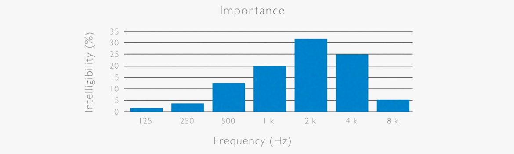
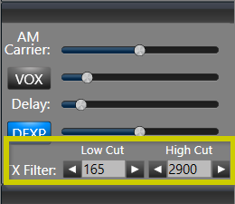
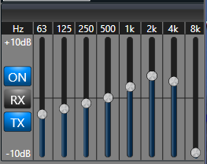
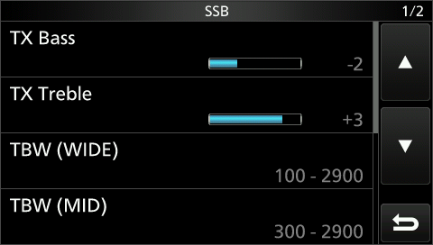

This page is dedicated to **Bob Heil, K9EID**, Bob passed away on February 28, 2024 (age 83 years).

Based on presentations given by Bob which are available online at:

- [Bob Heil - Adjusting your radio (The Beacon)](https://www.youtube.com/watch?v=PtgtdaD08p4)[^1]
- [Bob Heil - Optimize your audio (ARRL Maine)](https://www.youtube.com/watch?v=EPeHCNlX_MQ)[^2]

## Optimizing Ham Radio Audio the Bob Heil Way

### Who Is Bob Heil?



Bob Heil, K9EID, is a legend in both professional audio and amateur radio. Renowned for designing high-performance PA systems in music and later bringing that audio expertise to ham radio microphones, Heil’s advice on SSB audio has become essential for operators who want not just loud, but intelligible and effective transmitted voice. Many of his concepts — like emphasizing the right speech frequencies and tuning rig equalizers — come from respecting how humans perceive speech and how SSB bandwidth limits shape what others hear.

### Fundamentals: Voice Frequencies and Speech Articulation

Human speech occupies a broad range of frequencies, but not all are equally important for intelligibility: [^3] [^4]

- Fundamentals: ~85–250 Hz – adds “presence” but contributes little to clarity on HF SSB.
- Vowels / Core Speech: ~350 Hz–2 kHz – most energy and essential for natural voice.
- Consonants / Intelligibility: ~1.5 kHz–4 kHz – critical for understanding speech, especially in noise.

Because amateur SSB transmit bandwidth is limited (typically ~2.4–3.0 kHz), maximizing useful content within that band is key. Too much bass makes your signal muddy; too much extreme treble does nothing past the cutoff and eats headroom.

Bob Heil often highlights the importance of boosting in the region near ~2.5 kHz because that’s where the ear best distinguishes consonants and articulation — improving clarity even on crowded bands.

### Transmit Bandwidth & Why It Matters

Every rig has a transmit filter — this defines what frequencies make it onto the air. Wider bandwidth gives more fidelity; narrower helps cut noise but can reduce articulation if too tight.

Typical settings (starting points, not absolutes)[^5]:

| Operating Goal       | TX Bandwidth Setting                 |
| -------------------- | ------------------------------------ |
| Rag-Chewing / Casual | ~100–2900 Hz (fidelity)              |
| Everyday Operation   | ~300–2700 Hz                         |
| DX / Contest         | ~400–2600 Hz (narrower but punchier) |

Bob advises listening with a separate receiver or SDR to hear what others actually receive, not just your mic monitor.

### Heil’s Mic & Equalizer Philosophy

Bob Heil prioritizes mid-range and upper-mid articulation, often trimming excessive low end and boosting where ears detect speech best. His microphones, especially dynamic elements like HC-series and PR-series, often have a built-in “articulation rise” around ~2–4 kHz.

Rather than leaving rigs at flat EQ, Bob encourages using built-in transmit equalizers (or an external parametric EQ) to:

- Cut low frequencies (muddy audio)
- Control midrange peaks (nasal or honky tones)
- Boost upper mids to improve clarity and cutting power

### Best Settings by Operating Style (Quick Reference)

| Operating Style | What You Want       | Suggested EQ Tweak                  | Filter Notes          |
| --------------- | ------------------- | ----------------------------------- | --------------------- |
| **Rag-Chewing** | Natural, warm       | Gentle high-mid boost, less low cut | Wider TX BW           |
| **DX Work**     | Penetrating & clear | More high-mid boost, deeper low cut | Slightly narrower BW  |
| **Contesting**  | Loud & distinct     | Strong high-mid, aggressive low cut | Narrow / optimized BW |

### Yeasu

#### Yeasu Parametric EQ: Starting Settings by Operating Style

Many modern Yaesu transceivers (FT-950, FT-2000, FTdx9000, FT-991A, etc.) include a three-band parametric EQ — each band lets you adjust center frequency, gain, and bandwidth. Heil provides starting points that you can refine by listening.

These are frameworks, not absolutes — operator voice, microphone, and station acoustics all make a difference.

| Band  | Center Frequency     | Bandwidth | Gain (Rag-Chew)    | Gain (DX/Contest)          |
| ----- | -------------------- | --------- | ------------------ | -------------------------- |
| Low   | 200 Hz               | 2         | *Notch / –6 dB*    | *Notch / –6 to –10 dB*     |
| Mid   | 900 Hz               | 2         | *Slight cut –6 dB* | *Flat or slight cut –6 dB* |
| High  | 2100–2400 Hz         | 2         | *Boost +6 dB*      | *Boost +6 to +10 dB*       |
| TX BW | ~400–2600 Hz (tight) | -         | Everyday / DX      | Contest                    |

*Notes:*

- Roll off low end; ham signals rarely benefit from heavy bass on SSB.
- Midrange sculpting tailors tone depth.
- Upper mid/high boost increases intelligibility and cut.

### FlexRadio[^6]

#### FlexRadio SmartSDR: TX Audio & EQ Settings

FlexRadio’s SmartSDR platform gives you powerful transmit audio control through its built-in TX equalizer and mic profiles — and many of the same audio principles Bob Heil teaches (focus on speech articulation, roll off low bass, and emphasize mid-to-upper midrange clarity) apply here as well.

#### SmartSDR Audio Tuning Basics

With FlexRadio you can:

- Select and create Mic Profiles — create separate profiles for rag-chewing, DX, and contesting to recall different settings instantly.
- Set Transmit Bandwidth (Low-Cut / High-Cut) — control how much of the audio spectrum is sent on-air (like a TX filter).

- Adjust the TX EQ sliders — SmartSDR provides an 8-band transmit equalizer, letting you boost/cut specific frequencies to shape tone and articulation.

A good workflow recommended by FlexRadio’s documentation is to first set BIAS and mic gain, then adjust TX low and high cut, and finally work the TX EQ sliders while listening to your audio (preferably into a monitor receiver or second receiver).

#### FlexRadio TX EQ Settings

| Frequency Band                        | Typical Adjustment                     | Rag-Chew                 | DX / Contest              |
| ------------------------------------- | -------------------------------------- | ------------------------ | ------------------------- |
| **Low (60–125 Hz)**                   | Reduce to remove boominess             | –8 to –12 dB             | –10 to –15 dB             |
| **Lower Mid (250–500 Hz)**            | Mild reduction to reduce mud           | –6 to –8 dB              | –8 to –10 dB              |
| **Mid (1 kHz)**                       | Flat or slight bump for natural speech | 0 to +2 dB               | 0 to +2 dB                |
| **Upper Mid (2–4 kHz)**               | Boost for articulation                 | +4 to +8 dB              | +6 to +10 dB              |
| **High (6–8 kHz)**                    | Slight presence lift                   | 0 to +4 dB               | +2 to +6 dB               |
| **TX Bandwidth (Low-Cut / High-Cut)** |                                        | 50–100 Hz / 2700–3100 Hz | 200–300 Hz / 2400–2900 Hz |

#### FlexRadio summary

- Rag-Chewing: Lower low-cut, slightly higher high-cut, gentle mid/upper mid boost
- DX Contacts: Higher low-cut, narrower high-cut, stronger mid/upper mid emphasis
- Contesting: Similar to DX, with more aggressive articulation emphasis

### Icom

#### Icom Transmit Audio: EQ & Settings

Many Icom HF transceivers (from IC-7300 up through IC-7600 and IC-7610) include simple Bass and Treble controls plus adjustable transmit bandwidth, allowing you to shape your SSB audio to emphasize speech clarity and purpose — whether rag-chewing or breaking pileups.

Key Icom audio controls:

- Bass EQ – cuts or boosts low frequencies (helps reduce muddiness).
- Treble EQ – adds presence and articulation in the upper speech band.
- Transmit Bandwidth (TBW) – selecting Wide, Mid, or Narrow controls which parts of the audio spectrum are transmitted.
- Compression – helps level voice peaks and increases perceived loudness without over-deviation.

Icom’s IC-7600 family and similar rigs have a built-in equalizer with many bass/treble combinations, giving you flexibility from warm and rich to tight and punchy transmit audio.

#### Starting EQ & Bandwidth Settings for Icom

Below are practical starting points for Icom rigs — based on Heil Sound recommendations and common operator experience. Use the rig’s monitor function (if available) or a second receiver to fine-tune by ear.

| Operating Style          | Transmit Bandwidth  | Bass (EQ)       | Treble (EQ)     | Compression     |
| ------------------------ | ------------------- | --------------- | --------------- | --------------- |
| **Rag-Chewing / Casual** | *Wide (2.9 kHz)*    | **–1 to 0 dB**  | **+2 to +3 dB** | **OFF or low**  |
| **Everyday / Mix**       | *Mid (2.4 kHz)*     | **–2 dB**       | **+3 dB**       | **Moderate**    |
| **DX / Contesting**      | *NAR (2.1–2.4 kHz)* | **–3 to –5 dB** | **+4 to +5 dB** | **On / 5–7 dB** |

Settings below assume dynamic or Heil iCM microphones; adjust mic gain so ALC barely moves on loud speech.

Tips by operating style:

- Wide transmit bandwidth lets more low and high frequencies through for natural-sounding rag-chew.
- Mid bandwidth balances fidelity with cutting presence for everyday contacts.
- Narrow (“NAR”) rolls off low frequencies more deeply, helping your voice cut through noise and pileups.
- Boosting treble emphasizes consonants, improving intelligibility - especially when the band gets noisy or during contests.
- Reducing bass trims muffled energy that wastes precious SSB bandwidth.

#### Icom settings

| Setting                | Rag-Chew (Wide)              | DX/Contest (NAR)             |
| ---------------------- | ---------------------------- | ---------------------------- |
| **Transmit Bandwidth** | Wide (~2.9 kHz)              | Mid/NAR (~2.4–2.1 kHz)       |
| **Bass EQ**            | –1 to 0 dB                   | –3 to –5 dB                  |
| **Treble EQ**          | +2 to +3 dB                  | +4 to +5 dB                  |
| **Compression**        | Off or light                 | On, ~5–7 dB                  |
| **Mic Gain**           | Adjust for ALC ~bottom range | Adjust for ALC ~bottom range |

### Summary

Here’s a quick glance at key points:

- Know the speech spectrum: Middle and upper mids (~1.5–4 kHz) carry intelligibility.
- Manage low end: Too much bass muddies your signal, especially through the limited SSB bandwidth.
- Use parametric EQ: With Yaesu rigs, adjust center freq, bandwidth, and gain to shape your audio.
- Match settings to purpose: Rag-chew for warmth; DX/contest for cut and intelligibility.

[^1]: [Bob Heil - Adjusting your radio (The Beacon)](https://www.youtube.com/watch?v=PtgtdaD08p4)
[^2]: [Bob Heil - Optimize your audio (ARRL Maine)](https://www.youtube.com/watch?v=EPeHCNlX_MQ)
[^3]: [dp microphones - facts about speech intelligibility](https://www.dpamicrophones.com/mic-university/background-knowledge/facts-about-speech-intelligibility/)
[^4]: [N.R. French & J.C. Steinberg: Factors governing the intelligibility of speech sounds. JASA vol. 19, No 1, 1947](https://jontalle.web.engr.illinois.edu/uploads/537.F18/Papers/FrenchSteinberg47.pdf)
[^5]: [Heil Ham Radio - DSP Settings](https://heilhamradio.com/dsp-settings)
[^6]: [FlexRadio - Adjusting your microphone settings for best TX audio](https://helpdesk.flexradio.com/hc/en-us/articles/14479680586395-Adjusting-your-Microphone-Settings-for-Best-TX-Audio)
