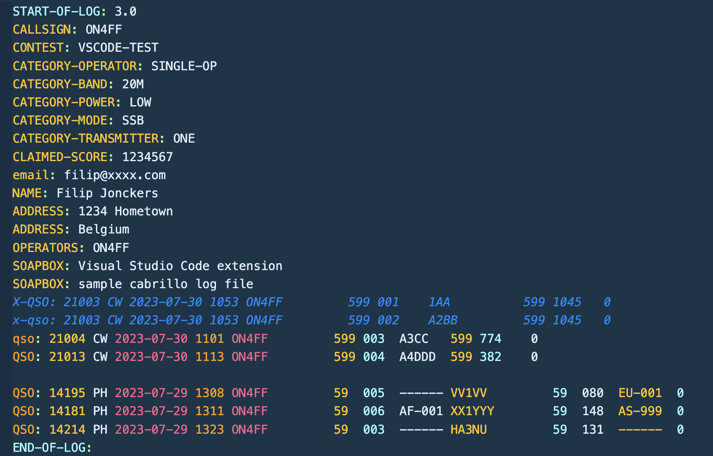

Cabrillo syntax highlighting Visual Studio Code extension.

## Features

This extension provides syntax highlighting for the Cabrillo contest log file format.  The standard file extensions are **.CBR** and **.LOG**.

## What is the Cabrillo file format

Ever since software became a part of amateur radio, there have been as many data formats as there were ham radio software developers. The Cabrillo Specification was originally developed by Trey Garlough, N5KO, to provide a standardized format for contest log submissions. Contest sponsors including CQ, ARRL, and DARC quickly supported the idea. More importantly, and key to its viability, leading software authors such as K1EA, N6TR, K8CC, W5XD, EI5DI, and others also embraced the concept.

Since its inception, the Cabrillo Specification has been recognized as the gold standard for contest logs and has revolutionized the contesting world. It has enabled many contests to support electronic log submission and automate the log-checking process. The WWROF administers the Cabrillo Specification on behalf of the contesting community.  The [Cabrillo file format specifications are available at https://wwrof.org/cabrillo](https://wwrof.org/cabrillo).

Today, the Cabrillo contest log format is widely adopted as the standard for importing and exporting amateur radio contest logs between software applications and submitting logs to contest organizers.

A Cabrillo log file consists of a header and the actual QSO data. The QSO data is presented in a tabular format, delimited by whitespace. The number of columns and field content is specific to each contest. Below are a few examples from some of the most popular contests:

- [CQ WW DX Contest](http://www.cqww.com/cabrillo.htm)
- [CQ WPX Contest](http://www.cqwpx.com/cabrillo.htm)
- [CQ WPX RTTY Contest](http://www.cqwpxrtty.com/cabrillo.htm)

Example:

## Download extension

The extension is available in the Visual Studio Code extensions [Marketplace](https://marketplace.visualstudio.com/items?itemName=filipjonckers.cabrillo-syntax-highlighting).

## About the author

Filip Jonckers is a licensed radio amateur since 1993 with the HAM radio callsign ON4FF (and previously ON1AFN).

## What is Amateur Radio

Radio amateurs can be found in nearly every country and from all walks of life.
They represent a diverse mix of backgrounds and professions, united by one common passion: a love for technology and radio.

Among their ranks are notable figures such as the late King Hussein of Jordan; King Juan Carlos of Spain; Joe Walsh (WB6ACU), guitarist of the Eagles; Marlon Brando (FO5GJ), actor; Tim Allen (KK6OTD), actor and comedian; Julio Iglesias (EA4TD), singer; and the late Indian Prime Minister Rajiv Gandhi. Carlos Menem, former president of Argentina, was also a licensed amateur radio operator.

But there’s room for you too.

You too can become a radio amateur!
Join a global community of over a million licensed radio enthusiasts and be part of a worldwide circle of friends.

## Extension Settings

None.

## Support and bug reports

Please report any issues via the [GitHub repository](https://github.com/filipjonckers/cabrillo-syntax-highlighting-vscode).  Also any contributions are much appreciated.

## For more information

- [Cabrillo file format specifications](https://wwrof.org/cabrillo/)
- [Submitting An Electronic Contest Log by Sean Kutzko KX9X](https://www.arrl.org/files/file/Contest%20-%20General/Tutorials/Submitting%20An%20Electronic%20Contest%20Log.pdf)
- [GitHub repository](https://github.com/filipjonckers/cabrillo-syntax-highlighting-vscode)
